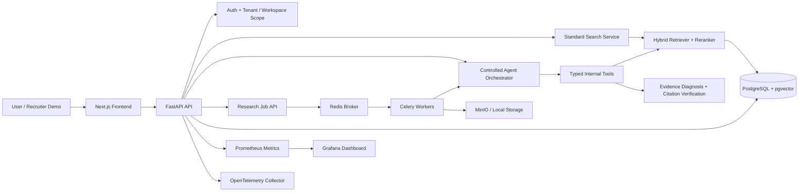
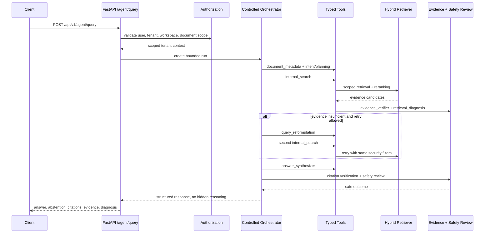
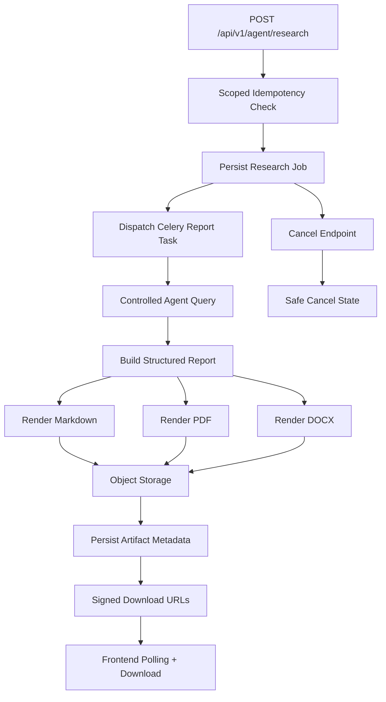

# Enterprise Knowledge Intelligence Platform


**A local-first, multi-tenant document intelligence platform that turns private knowledge bases into cited, controlled, auditable answers and research reports.**

EKIP is a portfolio-grade implementation of enterprise Retrieval-Augmented Generation with a deliberately constrained agent runtime. It keeps the stable `/api/v1/search` endpoint while adding disabled-by-default controlled agent workflows under `/api/v1/agent`.

## Problem

Enterprise teams often have useful knowledge scattered across policies, reports, tickets, PDFs, DOCX files, research notes, and internal briefs. A useful assistant must answer from those documents, cite exact evidence, avoid leaking tenant data, and fail clearly when evidence is missing.

The hard part is not just retrieval. The hard part is making the system safe enough to trust:

- Is the answer grounded in available documents?
- Did retrieval fail, or does the knowledge base truly not contain the answer?
- Are citations real and relevant?
- Did an uploaded document try to inject instructions?
- Can one tenant or workspace see another tenant's evidence?
- Can an agent run forever, call unsafe tools, or hide its reasoning?

## Why Standard RAG Is Insufficient

Basic RAG usually follows a single path: retrieve chunks, pass them to a model, and return text. That is useful for prototypes, but it is weak for enterprise workflows because it often lacks:

- scoped tenant/workspace authorization at every step;
- structured diagnosis for retrieval failure versus knowledge absence;
- retry and reformulation that preserve security filters;
- citation validation and unsupported-claim removal;
- conflict detection across evidence;
- prompt-injection handling for retrieved text;
- idempotent background workflows for report exports;
- auditable step summaries without exposing hidden reasoning.

EKIP treats these as first-class system behavior rather than UI polish.

## Controlled Agentic RAG

The controlled agent is not an unrestricted autonomous agent. It is a deterministic orchestration layer with typed tools, bounded steps, explicit feature flags, safe persistence, and scoped authorization.

`POST /api/v1/agent/query` runs this loop:

1. authorize tenant, workspace, and optional document scope;
2. classify intent and build a deterministic plan;
3. call typed internal tools for metadata, search, diagnosis, verification, synthesis, and safety;
4. optionally reformulate and retry retrieval without weakening filters;
5. verify evidence, citations, and claims;
6. return a structured answer, abstention, conflict, or safe failure.

External-source tools exist only as approved, disabled-by-default providers. They require both backend feature flags and explicit request opt-in.

## Key Capabilities

- Multi-tenant account registration, JWT auth, workspace isolation, and role-aware document access.
- Secure document upload and ingestion for PDF, DOCX, text, Markdown, HTML, CSV, and source code.
- Hybrid BM25 plus deterministic vector retrieval, reranking, retry, evidence sufficiency, and abstention.
- Stable standard RAG endpoint at `POST /api/v1/search`.
- Controlled agent endpoint at `POST /api/v1/agent/query`.
- Safe run inspection at `GET /api/v1/agent/runs/{run_id}`.
- Disabled-by-default asynchronous research reports under `/api/v1/agent/research`.
- Markdown, PDF, and DOCX research artifacts with scoped storage keys and short-lived signed download parameters.
- Prometheus metrics, Grafana dashboard provisioning, structured logs, and OpenTelemetry collector support.
- Docker Compose profiles for default runtime, observability, optional SearXNG, and optional Ollama.

## Architecture Overview



## Controlled Agent Execution Flow



## Research Report Workflow



## Technology Stack

| Layer | Technology |
| --- | --- |
| Backend API | Python 3.12, FastAPI, Pydantic v2, SQLAlchemy async |
| Frontend | Next.js 16.2, React 19, TypeScript, Vitest, Playwright |
| Retrieval | BM25, deterministic local embeddings, reranking, pgvector-ready schema |
| Database | PostgreSQL 16 with pgvector, SQLite for lightweight local mode |
| Jobs | Redis, Celery ingestion/evaluation/report workers |
| Storage | Local filesystem or MinIO-compatible object storage |
| Observability | Prometheus, Grafana provisioning, OpenTelemetry collector, structured logs |
| Security | JWT auth, tenant/workspace scoping, upload validation, request-size limits, SSRF controls |
| Optional Providers | Ollama, OpenAI/Azure adapters, deterministic external provider, self-hosted SearXNG, Wikipedia, arXiv |

## Security Controls

- Tenant and workspace scope enforced in API dependencies and service queries.
- Document scope checked before retrieval, research jobs, artifact metadata, and downloads.
- Agent tools are allowlisted and typed; unknown tools and unsafe scope changes are rejected.
- No shell, SQL, arbitrary filesystem, unrestricted URL, or user-supplied browser tools.
- Prompt-injection scanning for uploaded and external content paths.
- SSRF and outbound host validation for approved external providers.
- Short-lived signed artifact download parameters.
- Object keys scoped by tenant, workspace, job, and artifact.
- Request body size limits and upload MIME validation.
- Safe run timelines store operational summaries, not private chain-of-thought.
- Metrics avoid labels containing queries, document text, users, tenants, or filenames.

## Retrieval Diagnosis

EKIP distinguishes **retrieval failure** from **knowledge absence**. This matters because the correct action is different:

- Retrieval failure: retry, reformulate, expand top-k, or inspect ingestion health.
- Knowledge absence: abstain and tell the user the workspace does not contain enough evidence.

Search and agent responses include safe `retrieval_diagnosis` fields such as evidence count, support score, retry status, reason code, and diagnosis status. Retry paths preserve tenant, workspace, document, and security filters.

## Evidence And Citation Verification

The controlled agent normalizes evidence into structured internal and external source records, then validates claims and citations before returning an answer.

Implemented evidence behavior includes:

- internal evidence normalization with tenant/workspace scope;
- external provenance fields for approved providers;
- source-aware rank fusion;
- citation-label validation;
- unsupported-claim removal;
- partial-evidence and conflict outcomes;
- abstention when evidence is insufficient or unsafe.

## Research Reports

The research workflow is disabled by default and runs through the existing report worker when enabled.

Core endpoints:

- `POST /api/v1/agent/research`
- `GET /api/v1/agent/research`
- `GET /api/v1/agent/research/{job_id}`
- `POST /api/v1/agent/research/{job_id}/cancel`
- `GET /api/v1/agent/research/{job_id}/artifacts`
- `GET /api/v1/agent/research/{job_id}/download/{format}`

Reports use the controlled agent, preserve authorization, support scoped idempotency, and export markdown/PDF/DOCX artifacts through the storage abstraction.

## Screenshots

Screenshots are intentionally not committed yet. Use [docs/portfolio/SCREENSHOT_GUIDE.md](docs/portfolio/SCREENSHOT_GUIDE.md) to capture:

| Screenshot | Placeholder |
| --- | --- |
| Landing/login | `docs/portfolio/screenshots/01-login.png` |
| Document upload | `docs/portfolio/screenshots/02-document-upload.png` |
| Search result | `docs/portfolio/screenshots/03-search-result.png` |
| Agent workspace | `docs/portfolio/screenshots/04-agent-workspace.png` |
| Evidence and citations | `docs/portfolio/screenshots/05-evidence-citations.png` |
| Run timeline | `docs/portfolio/screenshots/06-run-timeline.png` |
| Research job | `docs/portfolio/screenshots/07-research-job.png` |
| Report artifacts | `docs/portfolio/screenshots/08-report-artifacts.png` |
| Grafana dashboard | `docs/portfolio/screenshots/09-grafana-dashboard.png` |
| Architecture diagram | `docs/portfolio/screenshots/10-architecture.png` |

## Local Quick Start

Backend-only lightweight mode:

```bash
cp .env.example .env
python3.12 -m venv .venv
source .venv/bin/activate
pip install -e "./backend[dev]"
cd backend
AUTO_INIT_DB=true DATABASE_URL=sqlite+aiosqlite:///./ekip.db JOB_EXECUTION_MODE=inline OBJECT_STORAGE_PROVIDER=local uvicorn app.main:app --reload
```

Frontend:

```bash
cd frontend
npm ci
npm run dev
```

Open:

- Frontend: `http://localhost:3000`
- API docs: `http://localhost:8000/docs`

## Docker Startup

Default full local runtime:

```bash
cp .env.example .env
docker compose up --build
```

Observability profile:

```bash
docker compose --profile observability up -d --build
```

Optional SearXNG profile:

```bash
docker compose --profile web-search up -d searxng
```

The default Docker setup starts PostgreSQL, Redis, MinIO, backend, frontend, and Celery workers. The backend runs Alembic migrations on startup and `minio-init` creates the object-storage bucket.

## Feature Flags

The portfolio-safe default keeps agentic and external workflows disabled.

```env
AGENTIC_RAG_ENABLED=false
AGENT_RESEARCH_ENABLED=false
AGENT_WEB_SEARCH_ENABLED=false
AGENT_EXTERNAL_APIS_ENABLED=false
WEB_SEARCH_PROVIDER=disabled
NEXT_PUBLIC_AGENTIC_RAG_ENABLED=false
NEXT_PUBLIC_AGENTIC_RESEARCH_ENABLED=false
NEXT_PUBLIC_AGENT_EXTERNAL_SOURCES_ENABLED=false
```

For a local controlled-agent demo, enable only the flags you are demonstrating and keep provider choice explicit. See [docs/deployment/searxng-local-profile.md](docs/deployment/searxng-local-profile.md) for the optional SearXNG profile.

## Tests And Validation

Core commands:

```bash
cd backend
.venv/bin/pytest -vv
.venv/bin/ruff check app tests
.venv/bin/ruff format --check app tests
.venv/bin/bandit -r app
.venv/bin/pip-audit

cd ../frontend
npm run lint
npm run typecheck
npm run test
npm run test:e2e
npm run build
npm audit --omit=dev
```

Latest recorded validation, from `VALIDATION_REPORT.md` and `TEST_RESULTS.md`:

- Backend: `117 passed, 2 skipped`, 76% coverage.
- Frontend: 9 Vitest files and 24 tests passed.
- Playwright: default mode `1 passed, 4 skipped`; enabled agentic mode `5 passed`.
- Security: Bandit no issues; pip-audit no known vulnerabilities for audited packages; npm audit 0 vulnerabilities.
- Docker: default, observability, and web-search Compose configs passed.
- Alembic: `upgrade head` passed; `alembic check` reported no new operations.
- Runtime resilience: Redis dispatch outage, MinIO export outage, backend restart, report-worker restart, ingestion-worker restart, PostgreSQL interruption, cancellation, and idempotency all recovered safely in local Docker validation.
- Observability: Prometheus targets up; Grafana API returned the `EKIP Agentic Runtime` dashboard; OpenTelemetry collector logged a backend trace batch.
- Load probes: 5/10/20 local users all returned 100% success.

## Release Information

- Current public release tag: `v0.2.1-controlled-agentic-rag`
- Previous protected tag: `v0.2.0-controlled-agentic-rag`
- License: MIT
- The repository is local-first and does not require paid APIs for default operation.
- AWS deployment, hosted CI, and live production claims are intentionally not made in this README.

## Limitations

- This is a portfolio/local validation project, not a claimed production deployment.
- Agentic RAG, research reports, and external tools are disabled by default.
- Live SearXNG quality depends on the local environment and public internet availability.
- Ollama generation is optional and was not used for the deterministic-core hardening path; the
  default validated path uses deterministic local extraction, support assessment, conflict
  detection, and citation checks.
- Documents uploaded before the structure-aware chunking update should be re-uploaded or
  reprocessed to receive improved heading/value chunks and section metadata.
- Practice-question topic lists require explicit Section, Topic, Chapter, Unit, or Subject
  headings. Malformed PDF equation extraction can still produce noisy fragments, so deterministic
  Search abstains when topic labels are not reliable.
- Load tests are laptop/local Docker probes and should not be extrapolated to enterprise capacity.
- Some scaffolded enterprise modules remain low coverage; see [KNOWN_LIMITATIONS.md](KNOWN_LIMITATIONS.md).
- Screenshots are placeholders until captured with the screenshot guide.

## Roadmap

- Add curated screenshots and a short demo video.
- Add production deployment guide after an actual deployment exists.
- Expand evaluation datasets with larger internal-document corpora.
- Add deeper alert-firing and trace-retention validation.
- Add enterprise identity provider integration.
- Add backup/restore drills and disaster-recovery automation.
- Improve coverage for scaffolded cache, audit, redaction, and document lifecycle modules.
- Add a documented reprocessing command for existing document versions after chunking upgrades.

## Deterministic Offline Mode

The core search and controlled-agent flows remain usable without Ollama, OpenAI, Bedrock,
LangChain, LangGraph, CrewAI, or any other generative model. Standard Search now performs
deterministic query normalization, hybrid retrieval, reranking, attribute-aware evidence
sufficiency, direct answer extraction, citation validation, and abstention. Controlled Agent uses
the same internal evidence rules through allowlisted tools, then displays the final answer outcome
separately from workflow completion.

Evidence support is no longer decided only by a global similarity threshold. Direct heading/value
facts such as `Topic: Functions` can support questions such as `What is the demo topic?`, while
unrelated facts like tutor qualifications or teaching methods are not treated as contradictions.
Confirmed conflicts require contradictory values for the same normalized subject and attribute.
Evaluation compares the grounded answer with the expected answer using normalized value match,
token F1, evidence support, citation validity, abstention status, and retrieval diagnosis.

Search, Controlled Agent, Evaluation, and Research publish one validated canonical
response state. It distinguishes supported and composite answers, real evidence
conflicts, bounded knowledge absence, retrieval failure, ambiguity, low-quality
sources, insufficiency, processing failure, and cancellation. Claim-linked
citations, confidence components, retrieval/fallback state, and selected-document
scope are validated together before rendering. See
[response-state consistency](docs/architecture/response-state-consistency.md).

## Project Structure

```text
backend/                         FastAPI API, agents, RAG, ingestion, jobs, database models
frontend/                        Next.js UI, agent/research workspaces, Playwright tests
docs/api/                        API notes for agent and research workflows
docs/architecture/               Architecture, retrieval, evidence, and runtime design docs
docs/deployment/                 Docker, observability, SearXNG, Ollama, runtime guides
docs/evaluation/                 Evaluation, resilience, load, and validation reports
docs/operations/                 Operator controls, release checklist, incident response
docs/portfolio/                  Recruiter-ready case study, demo script, interview guide
docs/security/                   Threat models and agent/external-content security docs
monitoring/                      Prometheus, Grafana, OpenTelemetry, SearXNG config
scripts/                         Local validation and utility scripts
workers/                         Worker scaffolding and role-specific worker packages
```

See [PROJECT_TREE.txt](PROJECT_TREE.txt) for the generated repository tree.

## Portfolio Docs

- [Case Study](docs/portfolio/CASE_STUDY.md)
- [Demo Script](docs/portfolio/DEMO_SCRIPT.md)
- [Interview Guide](docs/portfolio/INTERVIEW_GUIDE.md)
- [Screenshot Guide](docs/portfolio/SCREENSHOT_GUIDE.md)
- [Existing Controlled Agentic RAG Case Study](docs/portfolio/controlled-agentic-rag-case-study.md)

## License And Author

MIT License. See [LICENSE](LICENSE).

Author: repository owner / portfolio maintainer. Update this line with your preferred public name, portfolio URL, and contact link before sharing widely.
# Phase 2 semantic retrieval

The shared Search, controlled Agent, Evaluation, and Research retrieval path supports
operator-provisioned local CPU sentence embeddings, calibrated BM25/semantic fusion,
and an optional local cross-encoder reranker. Both model features are disabled by
default; unavailable models fall back safely without changing workspace or selected
document scope. Existing documents require the authorized idempotent re-index action
to receive indexing version `2.0` vector provenance.

See [semantic retrieval architecture](docs/architecture/semantic-retrieval-and-reranking.md),
[local model deployment](docs/deployment/local-embedding-models.md),
[retrieval evaluation](docs/evaluation/retrieval-quality.md), and
[local model security](docs/security/local-model-security.md).
